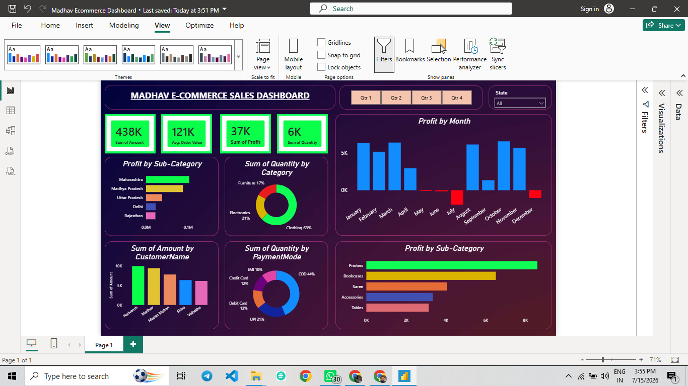

#  Madhav Ecommerce Sales Dashboard

## Overview

This project presents an interactive Power BI dashboard built to analyze ecommerce sales performance. The dashboard provides insights into sales, profit, customer behavior, payment methods, product categories, and monthly trends.

---

## Dashboard Preview

---

## Key Metrics

- Total Sales: 438K
- Average Order Value: 121K
- Total Profit: 37K
- Total Quantity Sold: 6K

---

## Dashboard Features

- KPI Cards
- Monthly Profit Analysis
- Profit by State
- Profit by Sub-Category
- Quantity by Category
- Quantity by Payment Mode
- Customer-wise Sales Analysis
- Quarter Filter
- State Filter

---

## Tools Used

- Power BI Desktop
- Power Query
- Excel/CSV

---

## Dataset

- Orders.csv
- Details.csv

---

## Files Included

- Madhav Ecommerce Dashboard.pbix
- Orders.csv
- Details.csv
- dashboard.png

---

## Skills Demonstrated

- Data Cleaning
- Data Modeling
- DAX Measures
- Interactive Dashboard Design
- Business Intelligence
- Data Visualization
